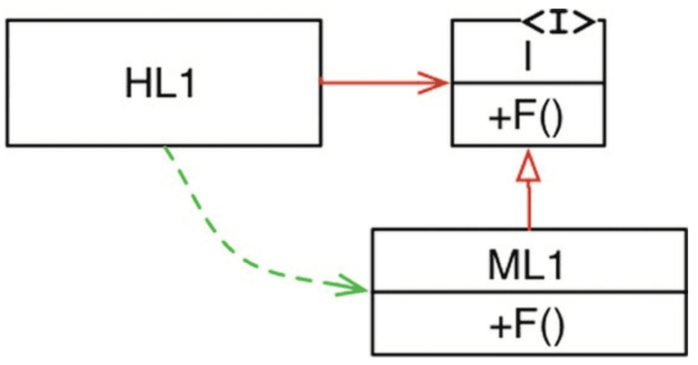

# 1장. 설계와 아키텍처 

### 설계(design) vs 아키텍처(architecture)
전체 설계의 구성요소 관점에서는 설계와 아키텍처를 구분지을 필요 X 
> 아키텍처는 고수준, 설계는 저수준의 세부사항이라고 하지만 건축/SW 설계에서는 개별적으로 존재할 수 없다. 

### 좋은 SW 설계의 목표 
- 필요한 시스템을 만들고 **유지보수**하는데 투입되는 리소스를 최소화
- 새로운 feature 때마다 비용이 증가한다면 나쁜 설계

### 나쁜 신호 
직원이 많아지지만, 코드 생산성(LoC)가 그대로라면 생산성은 떨어지는 것 
- 시스템 급하게 개발, 코드와 설계의 구조를 클린하게 하고자하지 않으면 생산성은 떨어짐 

### 토끼 개발자와 거북이 개발자 
- 토끼 개발자 : 일만 계속하지만, 설계의 중요성을 알고서도 실천하지않음. 생산성 유지할 수 있을 것이라고 기대만 함
- 거북이 개발자 : 좋은 아키텍처가 무엇인지 이해하고, 좋은 설계와 아키텍처를 가진 시스템을 생성함 

즉, 시장과 일정 때문에 바빠서 `코드는 나중에 정리` 라고 얘기도 정리하지 않게 된다 
> 엉망으로 만들면 깔끔하게 유지하면서 진행하는 개발보다 속도는 느리다 

### 결론 
- 개발조직에 스며든 과신을 인지할 것 
- SW 아키텍처 품질을 고민하기 위해서는 **좋은 소프트웨어 아키텍처가 무엇인지 알아야함**

-------

# 2장 행위(Behavior)와 구조(structure)

행위 (기능) 
- 기능 명세서나 요구사항 문서 구체화를 돕고, 이에 따라 코드를 작성 
- 대부분이 기능을 구현하고 버그를 수정하는 일이 전부라고 생각하는 개발자가 많다.

아키텍처 (구조)
- 소프트웨어는 변경하기 쉬워야 한다.
- 변경을 하는데 있어 어려움은 범위에 비례, 변경사항의 형태(shape)와는 관련이 없어야함
  - 특정 시스템에 맞추어져 설계된다면 변경하기 어려움 
- 소프트웨어의 변경을 쉽고, 실용적이기 위해선 **아키텍처는 형태에 독립적이여야 한다.**

### 아이젠하워 매트릭스 (중요성과 긴급성)
행위 
- 긴급하지만, 매번 높은 중요도는 아님 (늘 중요도는 다르다)
아키텍처
- 중요하지만 즉각적인 긴급성을 필요로 하는 경우는 없음 
  - 유지보수 측면에서는 필요한 리팩토링이 없어도 프로그램이 정상적으로 동작하기 때문에 긴급해보이지 않음 

> 이 때문에 중요도가 높은 아키텍처는 무시되기 일수이고, 중요도가 떨어지는 기능을 먼저 우선적으로 하게 된다.

### 결론 
- 아키텍처를 위해 투쟁해야한다. 
- SW 개발자는 아키텍처 개선을 위해 다른 팀과 투쟁해야한다.
- 아키텍처가 후순위가 된다면 시스템을 개발하는 비용이 더 많이 들고, 변경을 가하는 것이 점점 더 현실적으로 어려워진다. 

---

# 3장 프로그래밍 패러다임 

### 구조적 프로그래밍 
- 무분별한 `goto` 를 사용하지않고, 분기(`if/then/else`)와 반복(`do/while/until`)과 같은 제어구문을 사용하도록 하는 방식 
- 구조적 프로그래밍은 **제어흐름의 직접적인 전환에 대해 규칙을 부과** 

### 객체 지향 프로그래밍 
- 함수 호출 스택 프레임(stack frame)을 heap으로 옮기면, 함수 호출이 반환된 후에도 함수에서 선언된 지역 변수가 오랫동안 유지될 수 있음을 발견
- 즉, heap에서 호출한 함수는 클래스의 생성자가, 오랫동안 유지된 지역 변수 -> 인스턴스 변수, 중첩 함수 -> 메서드
- 객체 지향 프로그래밍은 **제어흐름의 간접적인 전환에 대해 규칙을 부과**
> 함수 포인터를 특정 규칙에 따라 사용한다. 

### 함수형 프로그래밍 
- 수학적 문제를 해결하는 과정에서 `lambda` 계산법 발견 
- lambda 의 기초 개념 불변성 : 심볼의 값이 변경되지 X 
- 함수형 언어에는 할당문이 전혀 없다는 뜻 
- 함수형 프로그래밍은 `할당문에 대해 규칙을 부과한다`
> 할당문을 쓰지 못하도록 한다.

### 결론
- 각 세가지 프로그래밍 페러다임은 일종의 규칙을 부과함으로써, 프로그래머에게 특정 권한 박탈
- 패러다임은 **무엇을 해서는 안되는지를 말한다.**

---

# 4장 구조적 프로그래밍 

### 증명 
- Dijkstra가 초기에 인식한 문제
- 수학적인 원리 `증명` 을 통해 예상 외의 방식으로 실패하는 것을 해결하고자 함 
- 프로그래머는 입증된 구조를 이용하여 코드가 올바르다는 사실을 스스로 증명하게 되는 방식 
- 단순한 제어 구조는 순차 실행과 결합하였을 때 특별하다. 
  - 모듈을 증명 가능하게 하는 제어 구조 = 모든 프로그램을 만들 수 있는 제어 구조의 최소 집합 
  - ->  구조적 프로그래밍의 탄생 
- 모듈을 증명 가능한 더욱 작은 단위로 재귀적으로 분해(모듈을 기능적으로 분해할 수 있음)

> 테스트 : 기능이 실패할 것(거짓)이 아님을 증명하려고 시도 (이는 과학과 유사하다)

### 결론 
- 구조적 프로그래밍의 가치 : 반증 가능한 단위를 만들어 낼 수 있는 것 
- 소프트웨어는 수학보다 과학과 더욱 유사하다 (반증 가능성에 의해 주도된다.)
- 모듈, 컴포넌트, 서비스가 반증할 수 있게, 즉 테스트가 쉽도록 노력해야한다. 

---

# 5장 객체지향 프로그래밍 (OO 설계 원칙)

객체지향의 본질 
- 캡슐화
- 상속
- 다형성

### 캡슐화? 
- OO 언어는 데이터와 함수를 쉽고 효과적으로 캡슐화하는 방법을 제공
- 이를 통해서 데이터와 함수가 응집력있게 구성된 집단을 서로 구분 짓는 선을 그을 수 있도록 함 
- 구분선 바깥(ex_ 접근제어자)에서는 데이터는 은닉되고, 일부 함수만 외부로 노출된다. 
  - `private, public ...`

> OO 프로그래밍은 프로그래머가 충분히 올바르게 행동함으로써 캡슐화된 데이터를 우회하여 사용하지 않을 것이라는 믿음을 기반으로 한다. 
> 실제로 많은 OO 언어가 캡슐화를 강제하지는 않는다. 

### 상속? 
OO 언어는 더 나은 캡슐화를 제공하지는 못함. 
하지만 상속만큼은 객체지향언어가 확실히 제공했다. 
- OO 언어 이전에도 상속과 비슷한 기법이 사용되긴 했으나, 굉장히 불편
- 상속으로서 새로운 개념을 만들지는 못했지만, 데이터 구조적 면에서는 굉장히 편리한 방식을 통해 상속을 지원 

### 다형성?
- 객체지향 이전에도 다형성을 표현할 수 있는 언어는 존재
- 함수를 가리키는 `포인터`를 응용한 것이 다형성 
- 객체지향언어는 다형성을 좀 더 안전하고 편리하게 사용할 수 있도록 해줌
- 객체지향 언어는 제어흐름을 간접적으로 전환하는 규칙을 부과한다고 결론 지을 수 있다. 

### 다형성이 가진 힘 
- Plugin Architecture : 독립성을 지원하기 위해 만들어지고 적용됌
- 객체지향의 등장으로 언제 어디서든 플러그인 아키텍처를 적용할 수 있게 된다. 

### DI (의존성 역전)
다형성을 안전하고 편리하게 적용할 수 있는 메커니즘 등장 전, 호출 트리에서는 의존성 방향은 반드시 제어흐름(flow of control)을 따랐다. 

하지만 다형성을 통해 의존성과 제어흐름이 반대로 이루어질 수 있게 되었다. 

`HL1`은 `ML1` 모듈의 `F()`를 호출한다. 하지만 소스코드에서는 `HL1`모듈은 인터페이스를 통해 `F()`를 호출함 
`ML1`과 `I` 인터페이스 사이에 소스 코드 의존성(상속관계)이 제어흐름과는 반대로 흘러가는데, 이를 의존성 역전이라고 한다. 
- 이를 통해 객체지향 언어로 개발된 시스템을 다루는 SW 아키텍트는 소스 코드 의존성 전부에 대해 방향을 결정할 수 있는 절대적인 권한을 갖게되는 것이다. 
- 이것이 객체지향이 제공하는 힘 
- 이를 통해 비즈니스 규칙이 DB / UI 에 의존하지만, 소스코드 면에서는 의존성을 뒤집을 수 있어, 
UI와 DB와는 독립적으로 배포할 수 있다(배포독립성 - independent deployability)
- 개발 독립성 또한 갖게된다. (각 시스템 모듈이 독립적 배포가 가능하기 때문에 서로 다른 팀에서 각 모듈을 독립적으로 개발할 수 있음)

### 결론
- 객체지향 : 다형성을 이용하여 전체 시스템의 모든 소스 코드 의존성에 대해 절대적인 제어 권한을 획득할 수 있음 
- 객체지향 사용 -> 플러그인 아키텍쳐 구성 가능 
- 고수준 모듈이 저수준 모듈에 대해 독립성을 보장할 수 있음 