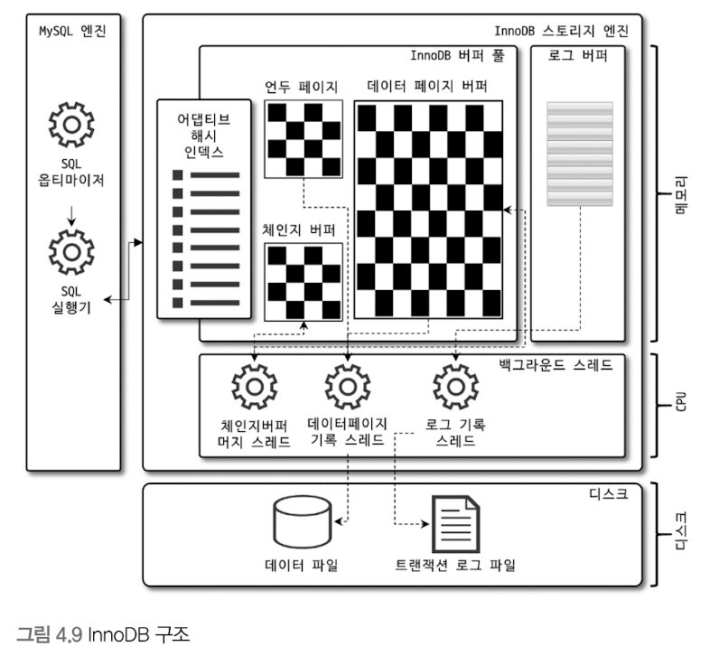
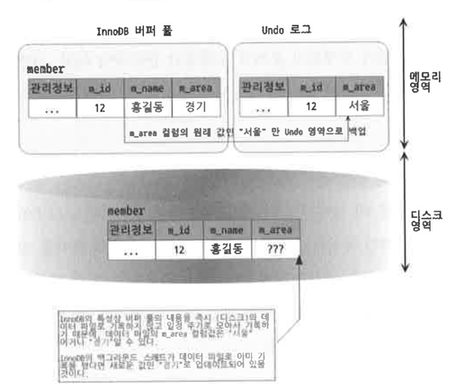

# 4.2 InnoDB Storage Engine Architecture 



**InnoDB**
- storage engine 중 유일한 record 기반 잠금 제공 
- 높은 동시성 처리 가능, 안정적, 성능 우수 


### 4.2.1 PK에 의한 클러스터링 

- InnoDB의 테이블 : 기본적으로 pk 기준, pk 값 순서대로 디스크에 저장 
- 모든 secondary index(보조 색인)은 pk의 논리 주소 사용 
- PK가 클러스터링 인덱스 이므로, pk 를 이용한 범위 스캔은 상당히 빠름 
- 따라서 쿼리 실행 계획은 PK 선택의 확률이 높음 

> MyISAM 은 클러스터링 키를 지원하지 않음 
> MyISAM에서 PK는 유니크 제약을 가진 보조 색인일 뿐 
> - 모든 테이블의 모든 인덱스는 물리적 레코드의 주소 값(ROWID)를 가짐


### 4.2.2 FK 지원 
- FK 지원은 InnoDB 스토리지 엔진 레벨에서 지원 
  - 따라서 MyISAM , Memory 테이블에서 사용 불가 
- FK는 부모/자식 테이블 모두 해당 칼럼에 인덱스 생성 필요
- 변경 시에는 반드시 부모/자식 테이블에 데이터가 있는 지 체크
  - LOCK이 여러 테이블에 전파 및 이로 인한 데드락이 발생할 수 있음 

- 수동으로 데이터 적재 / 스키마 변경 필요시 `foreign_key_checks = off`로 설정 
  - 외래 키 관련 체크 작업 일시적 멈춤 가능 (단, 일관성 맞춘 후 다시 활성화 필요)
  - 비활성화 시, `ON DELETE CASCADE`와 `ON UPDATE CASCADE` 무시 됨 

```sql
SET
foreign_key_checks=OFF;
SET
foreign_key_checks=ON;
```

### 4.3.3 MVCC(Multi Version Concurrency Control)
- 목적 : 잠금을 사용하지 않는 일관된 읽기를 제공하는 데 있음 
- InnoDB : Undo log 를 이용해 이 기능을 구현 

ex) Isolation level : `READ_COMMITED` 에서 데이터 변경 

```sql 
MEMBER TABLE 에 (12, '홍길동', '서울') record 존재 

mysql> UPDATE member SET area='경기' WHERE id=12;
```


- UPDATE 문이 실행되면 커밋 여부와 관계없이 InnoDB 버퍼 풀에는 새로운 값인 '경기'
- 원래 '서울'에 대한 값은 변경 전 값(서울)만 언두 로그에 복사
- COMMIT/ROLLBACK 이 되지 않은 상태에서 해당 레코드를 조회하면 어떤 값을 읽어 들일까에 대한 답은 MySQL 서버의 시스템 변수 `transaction_isolation`에 설정된 격리 수준에 따라 다름 
  - `READ_UNCOMMITTED` : InnoDB 버퍼 풀이 갖고 있는 변경된 데이터를 읽어서 반환
  - `REPEATABLE_READ, SERIALIZABLE` : 아직 커밋되지 않았기 때문에 언두 영역의 데이터를 반환


- 이처럼 `UPDATE` 쿼리가 실행되면 InnoDB 버퍼 풀은 즉시 새로운 데이터로 변경, 기존 데이터는 UNDO 영역에 복사과정
- 이러한 상태에서 COMMIT 명령 실행시, InnoDB는 더 이상 변경 잓업 없이 지금의 상태를 영구적 데이터로 만듦
- ROLLBACK 실행시, undo 영역의 백업 데이터를 InnoDB 버퍼 풀로 다시 복구, undo 영역 내용을 삭제 

> commit 된다고 undo 의 백업 데이터는 항상 바로 삭제되는 것은 아님
> - 이 언두 영역을 필요로하는 tx가 없어야 삭제된다. 

### 4.2.4 잠금 없는 일관된 읽기 (Non-Locking Consistent Read)
InnoDB 엔진은 MVCC 로 인해 lock을 걸지 않고 읽기 작업 수행 
- 격리 수준이 `SERIALIZABLE`이 아닌 수준은 순수 SELECT 는 다른 tx 변경 작업과 관계없이 항상 잠금을 대기하지 않고 바로 실행 
  - 이것이 `잠금 없는 일관된 읽기`
- InnoDB에서는 변경되기 전의 데이터를 읽기 위해 undo 로그를 사용한다.


### 4.2.5 자동 데드락 감지 
- 내부적으로 잠금이 교착 상태에 빠지지 않았는지 체크하기 위해 잠금 대기 목록을 그래프(Wait-for List) 형태로 관리
- InnoDB는 데드락 감지 스레드를 갖고 있어서 데드락 감지 스레드가 주기적으로 잠금 대기 그래프를 검사해 교착 상태에 빠진 트랜잭션들을 찾아서 그 중 하나를 강제 종료 
  - 이때 어느 트랜잭션을 먼저 강제 종료할 것인지를 판단하는 기준은 **트랜잭션의 언두 로그 양**
  - 언두 로그 레코드를 더 적게 가진 트랜잭션이 롤백의 대상
  - 언두 로그 양이 적은 트랜잭션을 롤백할 때의 비용이 더 적게 들기 때문

> 참고 :
> innodb 스토리지 엔진의 상위 레이어 : MySQL 엔진
> - `LOCAK TABLES(테이블 잠금)`은 볼 수가 없어 데드락 감지가 불확실 
> - `innodb_table_locks` 활성화 시 : 테이블 레벨 잠금까지 감지 가능

- 데드락 감지 스레드도 작업할 때 새로운 잠금을 걸고 데드락 스레드를 찾는데, 이 자체가 CPU에 부하 
- 이런 문제점을 해결하기 위해 `innodb_deadlock_detect` 시스템 변수를 제공
- 데드락 감지 스레드가 작동하지 않으면 무한 대기에 빠질 수 있다. 
- 이 역시 `innodb_lock_wait_timeout` 시스템 변수로 일정 시간이 지나면 자동으로 요청 실패되도록 설정할 수 있다.

> `innodb_lock_wait_timeout`
> - 초단위 설정 가능 
> - 데드락 감지 스레드가 부담되어 `innodb_deadlock_detect=off` 인 경우, 
> - `innodb_locak_wait_timeout` 을 default 값인 50초 보다 훨씬 낮은 시간으로 변경하여 사용할 것을 권장 