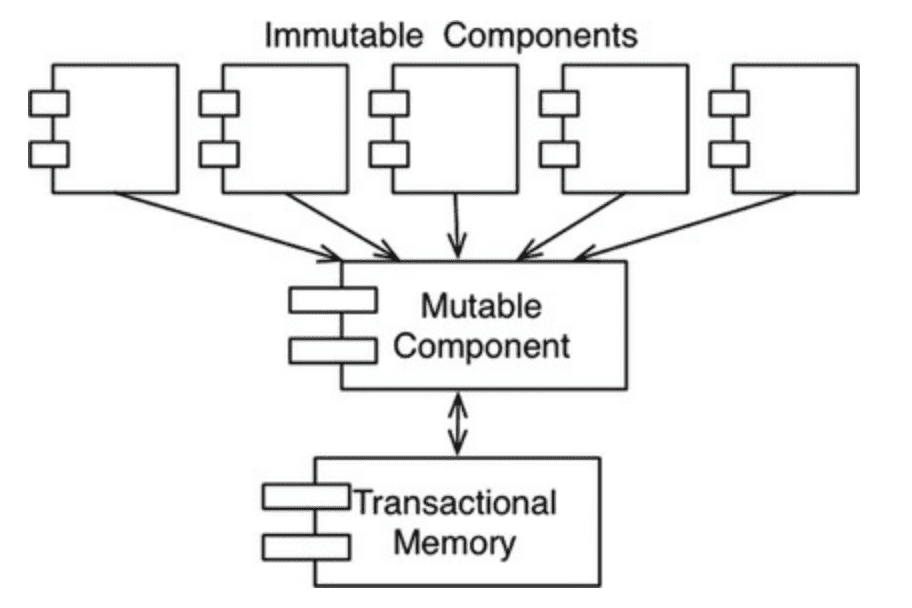

# 6장 함수형 프로그래밍(FP)

FP 패러다임의 람다(`lambda`)계산법으로 1930년 발명 

### 정수를 제곱하기 
- 리스프에서 파생한 클로저(Clojure)는 함수형 언어 
- Java는 가변 변수(Mutable Variable) 사용 - 가변 변수는 프로그램 실행중에 상태가 변할 수 있다. 
- 클로저는 이러한 가변 변수 존재 X 

> 함수형 언어에서는 변수는 한 번 초기화되면 절대로 변하지 않는다. 

### 불변성(Immutable)과 아키텍처 
가변 변수에 의해 아키텍처에서 발생하는 문제 
- Race Condition 
- DeadLock
- 동시 업데이트(Concurrent Update)

아키텍트는 동시성(Concurrency) 문제에 대해 고려할 줄 알아야한다. 

### 가변성의 분리 
불변성과 관련하여 **가변 컴포넌트와 불변 컴포넌트를 분리**하는 것이 중요하다. 
- 불변 컴포넌트 : 순수 함수 방식으로 작업 처리할 수 있도록 하며, 어떠한 가변 변수도 사용하지 않음
  - 변수의 상태를 변경할 수 있는, 즉 순수 함수형 컴포넌트가 아닌 하나 이상의 다른 컴포넌트와 통신하도록 한다 .
- 가능한 많은 처리를 불변 컴포넌트에서 진행하고, 가변 컴포넌트의 코드를 줄여야 함 

### 이벤트 소싱 
저장 공간과 처리 능력의 한계는 점점 없어지는 중 -> 가변 상태는 적어질 수 있는 환경 

이벤트 소싱[Event Sourcing] : 상태가 아닌 트랜잭션을 저장하는 전략 
- 상태가 필요해지면 단순히 상태의 시작점부터 모든 트랙재션으로 분류하여 처리 
- 저장 공간과 처리 능력이 충분하다면 어플리케이션이 완전한 불변성을 갖추도록 만들 수 있으며, 이는 곧 **완전한 함수형**
> ex) 소스 코드 버전 관리 시스템 (git)

### 결론
- 구조적 프로그래밍 :  제어흐름의 직접적인 전환에 부과되는 규율이다.
- 객체 지향 프로그래밍 : 제어흐름의 간접적인 전환에 부과되는 규율이다.
- 함수형 프로그래밍 : 변수 할당에 부과되는 규율이다.

> 소프트웨어, 즉 컴퓨터 프로그램은 순차(sequence), 분기(selection), 반복(iteration), 참조(indirection)로 구성된다. 그 이상도 이하도 아니다.

--- 

# 7장 SRP: 단일 책임 원칙

저자는 `SOLID` 원칙 중 가장 의미가 잘 전달되지 않은 원칙을 SRP라고 말한다. 
이름 때문에 사람들은 모듈이 단 하나의 일만 해야한다는 의미로 받아들이기 쉽지만 해당 의미에 대해서는 클래스(모듈)가 아닌 함수에 적절한 의미이다 
즉, 이 말은 
- 단일 모듈은 변경의 이유가 하나, 오직 하나뿐이어야 한다.
- 하나의 모듈은 하나의, 오직 하나의 **액터**에 대해서만 책임져야 한다. 

> 액터 : 변경을 요청하는 한 명 이상의 사람들 
> 모듈 : 가장 단순한 정의(소스 파일)
> 코드를 소스 파일에 저장하지 않는 경우 모듈은 단순히 함수와 데이터 구조로 구성된 응집된 집합

`응집된(Cohesive)`이란 단어가 SRP를 암시하며 단일 액터를 책임지는 코드를 함께 묶어주는 힘 

### 징후 1 : 우발적 중복 
- 서로 다른 액터가 의존하는 코드를 너무 가까이 배치하면 문제가 생긴다. 
- SRP는 **서로 다른 액터가 의존하는 코드를 서로 분리하라**고 말한다.

### 징루 2 : 병합 
- 하나의 소스 파일에 다양하고 많은 메서드를 포함하면 병합이 자주 발생한다. 
- 병합을 할 때는 항상 위험이 뒤따른다 
- **서로 다른 액터를 뒷받침하는 코드를 서로 분리**하여 병합 문제를 해결한다 

### 해결책 
- 가장 확실한 해결책 : 데이터와 메서드 분리하기 
  - 서로의 존재를 모르고 따라서 `우연한 중복`을 피할 수 있다. 
  - 하지만 이는 각 클래스를 인스턴스화하고 추적해야한다는 단점도 같이 존재
  - 위 문제를 해결하는 기법 **퍼사드(Facade)**패턴 
- 가장 중요한 메서드만 유지, 그 클래스를 덜 중요한 메서드들에 대한 퍼사드로 사용 가능

### 결론 
- 단일 책임 원칙은 객체지향에서의 메서드와 클래스 수준의 원칙 
- 상위 수준에서는 다른 형태로 존재 
  - 컴포넌트 수준 : 공통폐쇄원칙(Common Closure Principle)
  - 아키텍처 수준 : 아키텍처 경계(Architectural Boundary)의 생성을 책임지는 변경의 축(Axis of Change)
