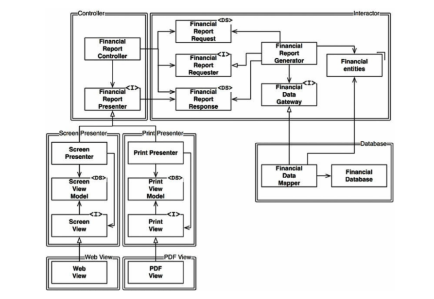
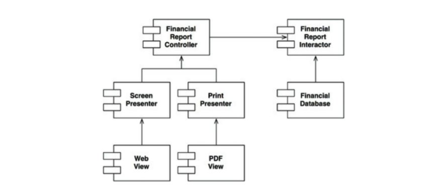
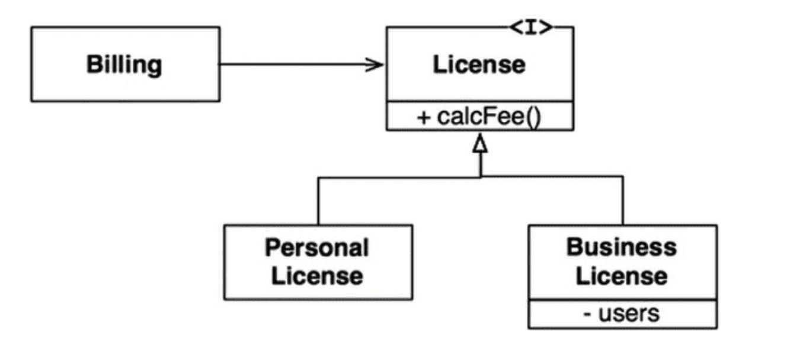
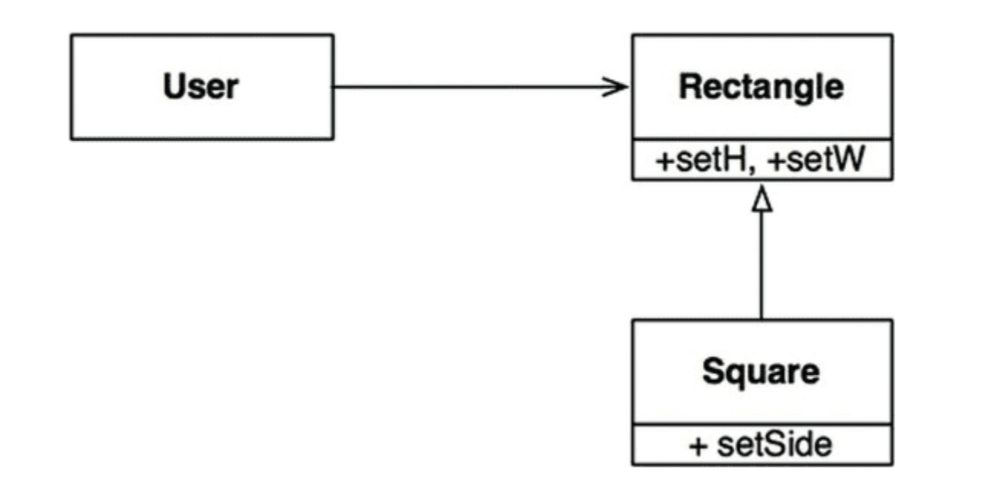
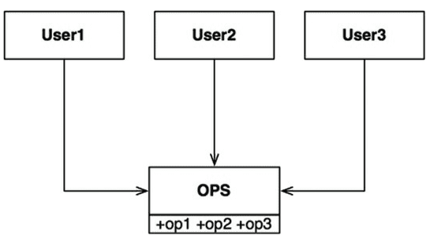
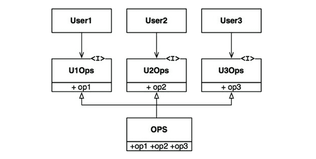

# 8장 OCP : 개방폐쇄 원칙

소프트웨어 개채(`artifact`)는 확장에 열려 있어야 하며, 변경에는 닫혀 있어야 한다. 
- 개체의 행위는 확장할 수 있어야 하지만, 이 때 산출물을 변경해서는 안된다.

### 사고 실험
A기능을 이용해 B형태로 보여주는 기능이 있다 
이 때, B 형태에 추가적인 사항이 생겨 새로운 C 형태로 보여주는 기능이 추가 되어야 할 때 
- 이상적인 코드 변경량 : 0 (변경되는 코드의 양을 최소화해야한다.)

위 그림에서 FinancialDataMapper은 구현관계를 통해, FinancialDataGateway를 알고 있지만, 
FinancialDataGateway는 FinancialDataMapper를 알지 못한다.
- `<I>` : 인터페이스 
- `<DS>` : 데이터 구조 
- `->` : 호출 관계 
- `-ᐅ ` : 구현 / 상속 관계 

-위 그림에서의 화살표는 변경으로부터 보호하려는 컴포넌트를 향하도록 그려진다. (단방향)
- Presenter에서 발생한 변경으로 부터 Controller을 보호하고자한다.
- View에서 발생한 변경으로 부터 Presenter을 보호하고자한다.
- Interactor는 모든 것에서 발생한 변경으로부터 보호하고자 한다.
- Interactor는 어떠한 변경에도 영향 받지 않는다. 가장 높은 수준의 정책을 포함한다.

### 아키텍처를 훌륭하게 만드는 방법 
핵심은 SRP 와 DIP에 있다. 
- 서로 다른 목적으로 변경되는 요소를 적절히 분리(SRP), 이 요소들 사이의 의존성을 체계화(DIP)를 통해 변경량을 최소화한다. 
- 기능이 how, why, when 에 따라서 기능을 분리하고, 분리한 기능을 컴포넌트 계층구조로 조직화한다. 
- 컴포넌트 계층구조를 이와 같이 조직화하면 저수준 컴포넌트에서 발생한 변경으로붑터 고수준 컴포넌트를 보호할 수 있다. 

### 방향성 제어 
- 컴포넌트간 의존성의 방향을 확실히 할 것 
- 의존성을 역전시켜 고수준 컴포넌트를 보호할 것 

### 정보 은닉 
**추이 종속성**
- 클래스 A가 Class B에 의존하고 B가 다시 Class C에 의존한다면, A는 C에 의존하게 된다.
- 추이 종속성을 가지게 되면, 소프트웨어 엔티티는 '자신이 직접 사용하지 않는 요소'에는 절대로 의존해서는 안된다.'는 원칙을 위반하게 된다. 
  - ISP, CRP(공통 재사용 원칙)과 관련 

### 결론 
OCP의 목표 
- 시스템을 확장하기 쉬운 동시에 변경으로 인해 시스템에 너무 많은 영향을 받지 않도록 한다. 
- 그러기 위해 시스템을 컴포넌트 단위로 분리하고, 저수준 컴포넌트에서 발생한 변경으로부터 고수준 컴포넌트를 보호할 수 있는 형태의 의존성 계층 구조를 이뤄야함 
---

# 9장 LSP : 리스코프치환 원칙 
하위 타입(subType)에 대한 정의 : 
- S 타입의 객체 o1에 대응하는 T타입 객체 o2가 있다. -> o1: S, o2: T
- T 타입을 이용해서 정의한 모든 프로그램 P에서 o2의 자리에 o1을 치환해도 P의 행위가 변하지 않는다면, S는 T의 하위 타입이다.

### 상속을 사용하도록 가이드 

- 위 사례는 LSP를 만족한다. 
  - `Billing` 의 행위는 `License` 하위 타입 중 무엇을 사용하는 지 의존적이지 않음
  - 하위 타입 모두 License 타입으로 치환 가능 
### Square/Rectangle 문제 

- 정사각형은 직사각형의 하위 타입으로는 적합하지 않음
  - 직사각형의 높이와 너비는 서로 독립적으로 변경될 수 있지만, 정사각형의 높이와 너비는 반드시 같이 변경 
  - 이를 해결하기 위해 조건문을 사용해야 정사각형인지 확인가능하며, 
  - 이러면 User의 행위는 사용하는 타입에 의존적이므로 결국 타입을 서로 치환할 수 없으므로 LSP를 만족하지 못함 

### LSP와 아키텍처 
- LSP는 인터페이스와 구현체에도 적용된다 
- 아키텍처 관점에서 LSP를 이해하는 최선의 방법은 이 원칙을 어겼을 때, 시스템 아키텍처에서 무슨 일이 일어나는 지 관찰하는 것 

### LSP 위배 사례 
- LSP를 위배했을 때 아키텍트는 REST 서비스들의 인터페이스가 서로 치환 가능하지 않다는 사실을 처리하는 중요하고 복잡한 메커니즘을 추가해야하는 상황도 생긴다. 

### 결론 
- LSP는 아키텍처 수준까지 확장할 수 있고, 반드시 확장해야한다
- 치환 가능성을 조금이라도 위배하면 시스템 아키텍처가 오염되어 상당량의 별도 메커니즘을 추가해야할 수 있다. 

---

# 10장 ISP : 인터페이스 분리 원칙 

각각의 유저 클래스가 숫자에 대응되는 단 하나의 `op?` 메서드를 사용한다고 가정하면
- `User1`의 소스 코드는 op2, op3을 사용하지 않음에도 의존적
- `OPS` 클래스에서는 op2의 소스 코드가 변경되면 `User1`도 컴파일 후 배포해야한다. 

이러한 문제는 다음과 같이 오퍼레이션을 인터페이스 단위로 분리하여 해결 가능

### ISP와 언어 
- 언어 타입(정적 동적)에 따라 소스 코드 의존성 여부가 다르다. 
- 따라서 ISP를 아키텍처가 아니라, 언어와 관련된 문제라고 결론내릴 가능성이 존재한다. 

### ISP와 아키텍처 
- 필요 이상으로 많은 걸 포함하는 모듈에 의존하는 것은 해로운 일 
- 불필요한 재컴파일과 재배포를 강제하기 때문

### 결론 
불필요한 짐을 실은 무언가에 의존하면 예상치 못한 문제에 빠질 수 있다 

# 11장 DIP : 의존성 역전 원칙 

### 유연성이 극대화된 시스템 
- 소스 코드 의존성이 추상(abstraction)에 의존하며, 구체(concretion)에는 의존하지 않는 시스템 
- 의존하지 않도록 피하고자 하는 요소 : 변동성이 큰(volatile) + 구체적(concretion)요소 
  - 구체적인 요소 : 개발에서 자주 변경될 수 밖에 없는 모듈 

### 안정된 추상화 
- 추상 인터페이스에 변경이 생김녀 이를 구체화한 구현체들도 따라서 수정해야 함 
- 반대로 구체적인 구현체에 변경이 생기더라도, 그 구현체가 구현하는 인터페이스는 대다수의 경우 변경될 필요 X 
- **즉, 인터페이스는 구현체보다 변동성이 낮음**

> DIP를 실천하는 법 
> 1. 변동성이 큰 구체 클래스를 참조하지 말라 
>   - 대신 추상 인터페이스를 참조할 것 
>   - 추상 팩토리(abstract factory)를 사용하도록 강제 
> 2. 변동성이 큰 구체 클래스로부터 파생하지 말 것 
>   - 정적 타입 언어에서의 상속은 소스 코드에 존재하는 모든 관계중 변경하기 어려움 
>   - 따라서 상속은 아주 신중하게 사용해야 한다 .
> 3. 구체 함수를 오버라이드 하지 말 것 
>   - 대체로 구체 함수는 소스 코드 의존성을 필요로 한다.
>   - 오버라이드하면 의존성을 상속하게 된다.
>   - 의존성을 제거하기 위해서, 추상 함수로 선언하고 구현체들에서 각자의 용도에 맞게 구현 할 것 
> 4. 구체적이며 변동성이 크다면 절대로 그 이름을 언급하지 말 것 

### 팩토리 

- 의존성 관리를 위해 추상 팩토리(Abstract Factory) 패턴 사용 

- `Application`은 `Service` 인터페이스를 통해 `ConcreteImpl` 사용하지만, `Application`에서는 어떤 식으로든 `ConcreteImpl` 인스턴스를 생성해야함 
- `ConcreteImpl`에 대해 소스 코드 의존성을 만들지 않으면서 이 목적을 이루기 위해 `Application`은 `ServiceFactory` 인퍼테이스의 `makeSvc()`를 호출 
- 이 메서드는 `ServiceFactory`로 부터 파생된 `ServiceFactoryImpl`에서 구현된다. 
- 그리고 `ServiceFactoryImpl` 구현체가 `ConcreteImpl`의 인스턴스를 생성한 후 `Service`타입으로 반환한다. 

해당 곡선은 아키텍처의 경계를 뜻한다. 
- 이 곡선은 구체 / 추상 을 분리 
- 소스 코드 의존성은 해당 곡선과 교차할 때 모두 한 방향, 즉 추상적인 쪽으로 향한다. 
- 곡선은 시스템을 추상 컴포넌트/구체 컴포넌트로 분리 
  - 추상 컴포넌트 : application에서 모든 고수준 업무 규칙을 포함한다. 
  - 구체 컴포넌트 : 업무 규칙을 다루기 위해 필요한 모든 세부사항을 포함한다 
  - 즉 소스 코드 의존성은 제어흐름과 반대 방향으로 역전된다. -> DI 

### 구체 컴포넌트 
구체 컴포넌트에 구체적인 의존성은 없어야 하지만, DIP를 모두 없앨 수 없다. (일반적으로)
- 이를 구체 컴포넌트를 최소한 하나는 포함할 것인데, 이를 메인(main)이라 칭함 

### 결론 
DIP는 아키텍처 다이어그램에서 가장 눈에 드러나는 원칙 
- 의존성은 아키텍처 경계를 기준으로, 더 추상적인 엔티티가 있는 쪽으로 향한다. 
- 이 규칙을 의존성 규칙(Dependency Rule)이라 부른다. 