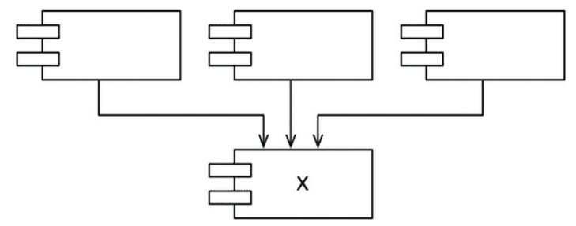

# 12장 컴포넌트 

컴포넌트 : 시스템의 구성 요소로 배포할 수 있는 가장 작은 단위 
- 컴파일러형 언어 : 바이너리 파일의 결합체
- 인터프리터형 언어 : 소스 파일의 결합체

> ex) java - .jar , ruby - .gem , .net -> .dll 

컴포넌트가 마지막으로 어떤 형태로 배포되든, 잘 설계된 컴포넌트라면 반드시 독립적으로 배포가 가능해야 하며 독립적으로 개발 가능한 능력을 갖춰야 한다.

### 컴포넌트의 간략한 역사 
- 소프트웨어 개발 초창기 : 프로그램이 로드될 주소 직접 제어 
- 구시대의 라이브러리 함수 접근 : 라이브러리 함수의 소스 코드를 application 코드에 직접 포함시켜 단일 프로그램으로 컴파일 
  - 이 때문에, 컴파일 과정 오래 걸리고, 메모리는 한정적
- 컴파일 시간 단축을 위해 함수 라이브러리를 개별적 컴파일 
- 라이브러리 사용 방식 : 라이브러리 로드하고 메모리 주소에 접근 방식

### 재배치성 
위에서 언급한 기존 라이브러리 사용 방식은 지속 가능하지 않았다. 

해결책 : 재배치가 가능한 binary 사용 
- 지능적인 로더를 통해 메모리에 재배치할 수 있는 형태의 바이너리를 생성하도록 컴파일러 수정 

- **외부 참조(external reference) 생성** : 프로그램이 라이브러리 호출 시, 컴파일러는 라이브러리 함수 이름  
- **외부 정의(external definition) 생성** : 라이브러리 함수를 젖ㅇ의하는 프로그램에 대해 컴파일러가 정하는 해당 이름 
  - 이를 통해 외부 정의를 로드할 위치가 정해지면, 로더가 외부 참조를 외부 정의에 링크 가능 
  - 이는 **링킹 로더(linking loader)**의 탄생 

### 링커 

링킹 로더(linking loader)의 등장으로 프로그램을 개별적 컴파일 / 로드 단위로 분할할 수 있게 되었다.
- 이후 프로그램은 점점 크기가 커졌고, 이 때문에 링킹 로더의 속도가 느려짐 
- 따라서 로드와 링크를 분리 

**링커** 
느린 부분의 링크 과정이 완료된 재배치 코드를 만듦 
- 이를 통해 로더의로딩 과정이 빠랄짐 

이후 무어(Moore)의 등장으로 메모리 저렴 / 디스크 작아짐 
- 이를 통해 다시 로드와 링크를 동시에 가능해짐 
- 다수의 `.jar` 파일 or 공유 라이브러리 링크 후, 실행 가능 

> 컴포넌트 플러그인 아키텍처(component plugin architecture)의 탄생 

--- 

# 13장 컴포넌트 응집도

### 컴포넌트 응집도의 세가지 원칙 
- REP: 재사용/릴리스 등가 원칙(Reuse/Release Equivalence Principle)
- CCP: 공통 폐쇄 원칙(Common Closure Principle)
- CRP: 공통 재사용 원칙(Common Reuse Principle)

### REP (재사용/릴리즈 등가 원칙)
> 재사용 단위는 릴리스 단위와 같다

- SW 설계와 아키텍쳐 관점에서 보면, **단일 컴포넌트는 응집성 높은 클래스와 모듈들로 구성**되어야 함 
- 컴포넌트를 구성하는 모든 모듈은 서로 공유하는 중요한 테마나 목적이 있어야 한다.
  하나의 컴포넌트로 묶인 클래스와 모듈은 버전 번호가 같고, 동일한 릴리스로 추적 관리어야한다. 
- REP를 어길 시, SW(모듈)은 `이치에 맞지`않게 된다. 

### CCP (공통 폐쇄 원칙)
> 동일한 이유로 동일한 시점에 변경되는 클래스를 같은 컴포넌트로 묶어야 한다. 
> 서로 다른 시점에 다른 이유로 변경되는 클래스는 다른 컴포넌트로 분리하라 

- 컴포넌트 관점의 SRP(단일 책임 원칙)
- 단일 컴포넌트는 변경의 이유가 여러 개여서는 안된다. 
- 대다수의 application에서 유지보수성은 재사용성보다 훨씬 중요 
- CCP는 변경될 가능성이 있는 클래스는 모두 한 곳으로 묶기를 권장 

> SRP와의 유사성
> - SRP → 서로 다른 이유로 변경되는 메서드를 서로 다른 클래스로 분리하라
> - CCP → 서로 다른 이유로 변경되는 클래스를 서로 다른 컴포넌트로 분리하라

### CRP (공통 재사용 원칙)
> 컴포넌트 사용자들을 필요하지 않는 것에 의존하게 강요하지 말라.

- 같이 재사용되는 클래스와 모듈들은 같은 컴포넌트에 포함되어야 한다. 
- 어떤 컴포넌트가 다른 컴포넌트를 사용하면, 두 컴포넌트 사이에는 의존성 생성 
- 의존하는 컴포넌트가 있다면 해당 컴포넌트의 모든 클래스에 대해 희존성을 확실히 인지해야 함 
- 강하게 결합되지 않은 클래스들은 동일한 컴포넌트에 위치시켜서는 안된다. 
- 어떤 클래스를 한 곳에 묶기보다는, **한 곳에 묶어서는 안되는 것**에 대해 피력

> ISP와의 유사성 
> - ISP → 사용하지 않는 메서드가 있는 클래스에 의존하지 말라고 조언
> - CRP → 사용하지 않는 클래스를 가진 컴포넌트에 의존하지 말라고 조언
> 
> 즉, 필요하지 않은 것에 의존하지 말라.

### 컴포넌트 응집도 균형 다이어그램 
- `REP, CCP` : inclusive 원칙 (컴포넌트를 크게)
- `CRP` : exclusive 원칙 (컴포넌트를 작게)

- 프로젝트의 컴포넌트 구조는 시간과 성숙도에 따라 변한다.
- 프로젝트가 실제로 수행하는 일 자체보다는 프로젝트가 발전되고 사용되는 방법과 더 관련이 깊다.

### 결론 
- 컴포넌트로 만들지 결정할 때, 재사용성과 개발가능성에 상충성을 고려할 것
- 균형을 맞추어 잡아야하는데, 이 균형점은 거의 항상 유동적 
- 결과적으로 시간이 흐름에 따라 프로젝트의 초점이 개발 가능성 -> 재사용성 
  - 그에 따라 컴포넌트를 구성하는 방식도 진화 

---

# 14장 컴포넌트 결합 

## ADP : 의존성 비순환 규칙 
> 컴포넌트 의존성 그래프에 순환이 있어서는 안된다(cycle X)

동일한 소스코드를 여러 사람이 수정하게 되면, 서로의 코드에 의존성 생성 
기존의 의존성을 가진 관계 중 의존성을 주던, 클래스의 수정이 발생하면 수정이 발생한 클래스를 사용하던 곳에서 작동하지 않게 된다. 

**해결 방법**
- 주 단위 빌드(weekly build)
- **의존성 비순환 원칙(Acyclic Dependencies Principle - ADP)**

### 주 단위 빌드 
- 중간 규모 프로젝트에서 흔히 사용 
- 일주일의 첫 4일 : 개별 코딩 / 금요일 - 통합 및 빌드 
- 장점 : 
  - 빠른 피드백 
  - 생각하지 않고 편하게 개발 가능 
- 단점 : 
  - 프로젝트가 커지면 통합 시에, 리소스 과다 요구 (효율성 하락)

### 순환 의존성 제거 
- 주 단위 빌드의 문제점 해결책 
- 개발 환경을 릴리스 가능한 컴포넌트 단위로 분리 
- 컴포넌트 사이의 의존성 구조 관리 필요 
- 의존성 구조에 순환이 존재해서는 X 

- 방향이 있지만 순환이 없는 그래프 (DAG - Directed Acyclic Graph)
- vertex : 컴포넌트 / direct edge : 의존성 관계 
- 어느 컴포넌트에서 시작하든, 의존성 관계를 통해 최초의 컴포넌트 조회 가능 
- 시스템 전체를 릴리스해야 한다면 상향식으로 진행 
  - entities -> DB, Interators -> ...
  - 의존성 파악을 통해 시스템을 빌드하는 방법/순서를 파악 가능 

### 순환의 문제점 
- 컴포넌트의 분리가 무의미/어려워짐 -> 하나의 컴포넌트가 되어버림 
- 단위 테스트 / 릴리스의 난이도가 어려워지며, 에러 발생 가능성 높아짐 
- 모듈의 개수가 많아짐에 따라 빌드 관련 이슈는 기하급수적 증가

`Authorizer` 의 의존성 추가 
- (DB -> Entities -> Authorizer)

### 순환 끊기 
순환이 발생된다면, 의존성을 다시 순환이 없도록 DAG로 만들어야 한다. 

**방법**
1. DIP 적용

- `User`가 필요로 하는 메서드를 제공하는 인터페이스 생성 
- 인터페이스를 `Entities`에 위치 
- `Authorizer`가 해당 인터페이스 상속 

2. `순한이 발생하는 컴포넌트 사이에 새로운 컴포넌트 생성`

- 순환을 끊을 수 있도록, 두 컴포넌트가 모두 의존하는 클래스들을 새로운 컴포넌트로 이동시킨다. 
> Jitters(흐트러짐)
> 요구사항이 변경되면 컴포넌트 구조도 변경될 수 있음 
> - 순환이 발생하면 어떤 식으로든 제거 필요 
> - 때로 새로운 컴포넌트 생성하거나 의존성 구조가 커질 수 있음을 시사 

### Top-down 설계 
컴포넌트 구조는 하향식으로 설계될 수 없음
 - 컴포넌트는 시스템에서 가장 먼저 설계할 수 있는 대상 X 
 - 컴포넌트 의존성 다이어그렘 != 애플리케이션 기능 
 - 컴포넌트 의존성 다이어그렘 == 어플리케이션의 빌드 가능성 / 유지보수성 시사 
 - 의존성 구조와 관련된 최우선적 고려사항 : **변동성 격리** 

## SDP (안정된 의존성 원칙)
안전성의 방향으로 더 안정된 쪽으로 의존하라 
- 변경이 쉽지 않은 컴포넌트가 변동이 잦은 컴포넌트에 의존하게 해선 X 
  - 한 번 의존하게 되면 변동성이 큰 컴포넌트는 결국 변경이 어려워짐 
- SDP 를 통해 변경하기 어려운 모듈이 변경하기 쉽게 만들어진 모듈에 의존하지 않도록 만들 수 있음 

### 안정성 (stability)
- 변경을 만들기 위해 필요한 작업량과 관련 
- 컴포넌트를 변경하기 어렵게 만드는 방법 : 수많은 컴포넌트가 해당 컴포넌트에 의존적으로 

< 불안정한 컴포넌트 `Y` > 

- 어떤 컴포넌트도 Y에 의존하지 않기 때문에 Y는 책임성이 없다
- 또한 Y는 세 개의 컴포넌트에 의존하므로 변경이 발생할 수 있는 외부 요인이 세 가지
  - Y : 의존적 

< 안정된 컴포넌트 `X` > 

- X는 세 컴포넌트를 책임진다(responsible) : 세 컴포넌트가 X에 의존하고 따라서 X 컴포넌트는 변경하지 말아야 할 이유가 세 가지나 있기 때문
- X는 독립적이다(independent) : X는 어디에도 의존하지 않으므로 X가 변경되도록 만들 수 있는 외적인 영향이 전혀 없다. 

### 안정성 지표 
- **Fan-in**: 안으로 들어오는 의존성(컴포넌트 내부의 클래스에 의존하는 컴포넌트 외부의 클래스 개수)
- **Fan-out**: 바깥으로 나가는 의존성(컴포넌트 외부의 클래스에 의존하는 컴포넌트 내부의 클래스 개수)
- **I(불안정성)** : `Fan-out / (Fan-in + Fan-out)` 
  - [0, 1] 범위의 값 (I = 0 최고의 안정된 컴포넌트) / (I = 1 최고로 불안정한 컴포넌트)

`CC` 컴포넌트 안정성 계산 
- `Fan-in` : 3 
- `Fan-Out` : 1 
- `I` : 1/4 

SDP에서 컴포넌트 불안정성은 그 컴포넌트가 의존하는 다른 컴포넌트들의 불안정성보다 커야한다. 

> 즉, 의존성 방향으로 갈수록 불안정성 지표 값이 감소해야 한다. 

### 모든 컴포넌트가 안정적이여야 하는 것은 아니다. 
- 모든 컴포넌트가 최고로 안정적인 시스템 -> 변경 불가능 
- 이상적인 구조 : 불안정한 컴포넌트도 있고 안정된 컴포넌트도 존재 

- 일반적으로 불안정한 컴포넌트는 위쪽에 위치 
- 위쪽에는 변경 가능한 컴포넌트, 아래의 안정된 컴포넌트에 의존
  - 만약 위로 향하는 화살표는 SDP를 위해하는 상태가 되기 때문 

**추상 컴포넌트**
오로지 인터페이스만을 포함하는 컴포넌트 생성하는 방식인 추상 컴포넌트는 굉장히 안정적 
- 따라서 덜 안정적인 컴포넌트가 의존할 수 있는 이상적인 대상 
  - 동적 타입 언어(ex_ 파이썬)를 사용할 때는 이러한 추상 컴포넌트가 X (추상 컴포넌트로 향하는 의존성 X)
  - 해당 언어들은 의존성 구조가 더욱 단순, 의존성 역전시 인터페이스를 선언하거나 상속받을 일이 없어서이다. 

## SAP (안정된 추상화 원칙)
> 컴포넌트는 안정된 정도만큼만 추상화되어야 한다. 

### 고수준 정책 위치 
고수준 아키텍처, 정책 결정 관련 SW
- 자주 변경되어선 안되는 소프트웨어 (I = 0)
- 하지만 고수준 정책을 안정된 컴포넌트에 위치시킬 시, 그 정책을 포함하는 소스코드는 수정이 어려움 
  - 시스템 전체 아키텍처의 유연성 하락 

**컴포넌트가 안정된 상태이면서 변경에 충분히 유연성을 가지는 방법 : OCP의 확장 개념**

### 안정된 추상화 원칙 
SAP는 **안정성**과 **추상화** 사이의 관계를 정의
- 안정된 컴포넌트 =  **추상 컴포넌트**여야 하며, 안정성이 컴포넌트 확장하는 것에 방해되어선 X 
- 불안정한 컴포넌트 = **구체 컴포넌트**여야 하며, 쉽게 변경될 수 있어야함 

**SAP + SDP = 컴포넌트계의 DIP**
  - SDP : 의존성의 방향은 안정성의 방향으로 + (안정성 == 추상화)
  - 따라서 의존성은 추상화의 방향으로 향한다.

결국, 안정적인 컴포넌트는 반드시 인터페이스 / 추상 클래스로 구성되어 쉽게 확장할 수 있어야 한다.

### 주계열
안정성(I)과 추상화(A) 의 관계 ㄱ래프 
- 최고 안정적 / 추상화 컴포넌트 = (0,1)
- 최고 불안정 / 구체화 컴포넌트 = (1,0)

배제 구역 : 고통의 구역  + 쓸모 없는 구역 
  - 컴포넌트가 위치해서는 안되는 영역 

고통의 구역 
- (0, 0) 주변 구역에 위치한 컴포넌트는 매우 안정적이며 구체적이다. 
- 뻣뻣한 상태이다. 추상적이지 않아서 확장할 수 없고, 안정적이므로 변경하기 상당히 어렵다.
- 하지만 변동성이 없는 컴포넌트는 (0, 0) 구역에 위치하더라고 해롭지 않음 (변동될 가능성이 없기 때문)

쓸모없는 구역
- (1, 1) 주변의 컴포넌트는 최고로 추상적이지만, 다른 컴포넌트에 의존하지 않음 
- 이러한 컴포넌트는 쓸모가 없다. 

배제 구역 벗어나기 
- 변동성이 큰 컴포넌트 대부분은 두 배제 구역으로부터 가능한 한 멀리 떨어뜨려야 한다.
- 주계열에 컴포넌트를 위치시키도록 해야한다. 
- 주계열 위 또는 가깝게 위치, 
  - 이렇게 위치하면 '너무 추상적'이지도 않고, 추상화 정도에 비해 '너무 불안정'하지도 않음

### 결론 

**의존성 관리 지표** : 설계의 의존성과 추상화 정도가 '훌륭한' 패턴에 얼마나 잘 부합하는지를 측정
책에서는 경험을 통해 좋은 의존성도 있지만 좋지 않은 의존성도 있다는 사실을 배웠고, '훌륭한' 패턴은 이러한 저자의 경험을 반영한다.

