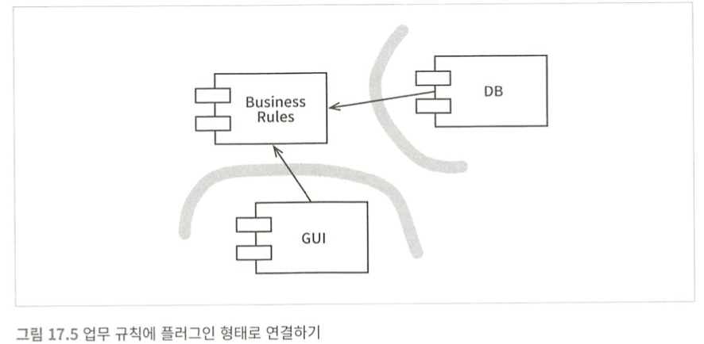
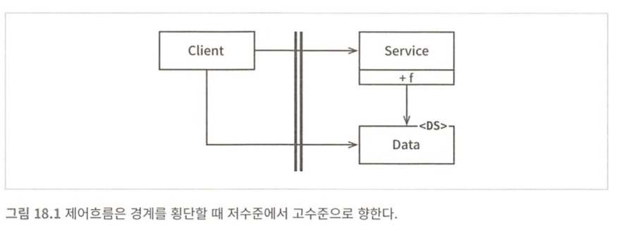
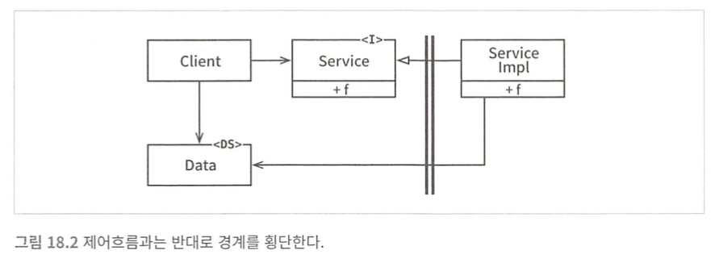
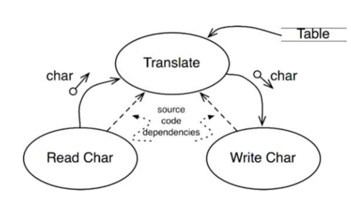

# 17장 경계: 선 긋기 

경계 
- 경계는 한편에 있는 요소가 반대편에 있는 요소를 알지 못하도록 막는다.
- 프로젝트 초기에 작성되는 경우도 있고, 매우 나중에 그어지는 경우도 있다. 
- 초기에 경계를 긋는 경우
  - 가능한 한 결정을 오랫동안 연기시키기 위해. 
  - 즉, 핵심적인 업무 로직을 오염시키지 못하게 만들려는 목적
- 경계를 지어야하는 이유 
  - 시스템의 업무 요구사항과 관련없는 결정에 따른 결합은 생산성을 떨어트리기 때문. (프레임워크, DB, 웹서버, 유틸리티 라이브러리, 의존성 주입 등에 대한 결정)
  - 좋은 아키텍처는 이러한 결정에 의존하지 않는다.

Good Example
- 어떠한 DB를 사용할 것인지에 대한 결정 
- 어떤 DB를 사용하더라도 상관없는 형태로 설계함으로써 의도적으로 DB에 대한 결정을 미루었다.
  - 방법 : 모든 데이터 접근 영역과 데이터저장소 영역 사이에 인터페이스 추가. (다형성, DIP)
    - DB가 없으므로 인터페이스의 구현체는 Stub 으로 만들었다.
    - 구현체 1: DB가 아닌 메모리에 저장하도록 함.
    - 영속성을 위해 MySql을 사용함. 추후에 하루만에 MySql 구현체를 추가한 사례 
  
> 업무 규칙과 데이터베이스 사이에 경계선(Boundary Line)을 그은 사례 

### 언제, 어떻게 선을 그어야 하는가 
관련이 있는 것과 없는 것 사이에 선을 긋는다.
- ex) GUI는 업무규칙 / DB - Business Logic 

-  플러그인 형태 
  - 손쉽게 생성 및 확장 가능 
  - 유지보수 용이 
  - 선택적, 다양한 선택지의 구현체가 가능한 컴포넌트를 분리 
    - 핵심적인 업무 규칙과의 분리 / 독립성 확보

### 결론 
- 경계선을 그리는 법 
  - 시스템 : 컴포넌트 단위 분할
  - 컴포넌트 사이의 의존적 화살표가 비즈니스 로직을 향하도록 컴포넌트 소스 배치
    - 고수준 추상화를 위해 DIP, SDP 

---

# 18장 : 경계 해부학 

### 경계 횡단하기 
런타임 경계횡단 
- 한쪽 경계에 있는 기능이 반대편 기능을 호출하여 데이터 전달
- 소스코드가 변경되면 의존하는 다른 소스 코드들도 변경/컴파일이 필요할 수 있음 
- 이에 소스 코드 의존성 관리를 하여 적절한 위치에서 경계를 횡단하도록 해야함
- 경계 : 이러한 변경 propagation 방지 및 관리 수단 

### 두려운 단일체 (소스 수준 분리 모드)
모놀리틱 : 배포 관점에서 경계가 들어나지 않음( ex_ jar)
- 다형성에 의존하여 내부 의존성을 관리 
- **저수준 -> 고수준에 의존**
  - 클라이언트와 서비스의 고/저수준에 따라 의존성 방향이 달라짐 

저수준 클라이언트와 고수준 서비스 

고수준 클라이언트와 저수준 서비스 

이처럼 모노리틱 구조 : 규칙적인 방식으로 구조 분리 - 개발,테스트,배포에 용이 
- 고수준 컴포넌트는 저수준 세부사항으로부터 독립적 유지

### 배포형 컴포넌트(배포 수준 결합 분리 모드)
- 아키텍처의 경계 : 물리적으로 드러남(eg. maven에 배포하는 library - 사용하는 서버는 레파지토리 분리)
- 단일체와 마찬가지로 경계를 가로지르는 통신은 함수호출 : 비용 저렴

### 스레드 
- 생략

### 로컬 프로세스 
강한 물리적 형태를 띄는 아키텍처 경계 
- 고수준 프로세스가 저수준 프로세스의 정보를 포함해서는 안된다(eg. PID, 물리주소, 레지스트리 키)
- 메모리 공유가 되지 않음 
  - 통신 : OS 호출, 데이터 마샬링, process context switch 
    - 비싼 작업
  - 따라서 통신이 빈번하지 않도록 제한 

### 서비스 
가장 강력한 물리적 형태를 띄는 아키텍처 경계 
- 서비스 경계를 지나는 통신은 함수 호출에 비해 느림 
- 지연에 따른 문제를 고수준에서 처리할 수 있어야함 (네트워크 레이턴시, 패킷 손실)
- 고수준 프로세스가 저수준 프로세스의 정보를 포함해서는 안된다 (ex_url)

### 결론 
단일체를 제외한 대다수의 시스템은 한 가지 이상의 경계 전략 사용 중

- 서비스 경계를 활용하는 시스템인 경우 
 - 로컬 프로세스 경계도 포함하고 있을 수 있다. 
 - 실제로 서비스는 상호작용하는 일련의 로컬 프로세스 퍼사드에 불과할 때가 많음
 - 또한 개별 서비스/로컬 프로세스는 링크된 배포형 컴포넌트의 집합이다.
- 즉, 대체로 한 시스템 안에서도 통신이 빈번한 로컬 경계와 지연을 중요하게 고려해야 하는 경계가 혼합되어 있음을 의미한다.

---

# 19장 : 정책과 수준 
SW 시스템은 정책을 기술한 것 / 정책 : 프로그램 핵심부의 전부 
- 정책 : 
  - 집계와 관련된 업무 규칙 처리 방식 서술 
  - 데이터를 어떠한 포맷형식으로 산출할 지에 대한 서술 
  - 입력 데이터에 대한 verification 방식 서술 

- 수준 
  - **입력과 출력까지의 거리**
  - 입력과 출력 모두로부터 멀수록 정책의 수준(level)은 높아짐 
  - 좋은 아키텍처는 각 컴포넌트를 연결할 때 : 의존성의 방향이 저수준에서 고수준을 의존하도록 설계 

- `Translate` 컴포넌트 : 입력과 출력에서 멀어, 수준이 가장 높음 
- 소스 코드의 의존성은 점선 방향 
- 모든 소스코드 의존성의 방향 : 고수준 정책을 향하도록 정책을 분리하는 것이 변경의 영향도를 줄일 수 있는 방법 
